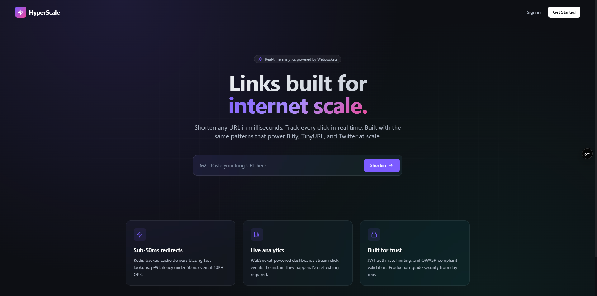
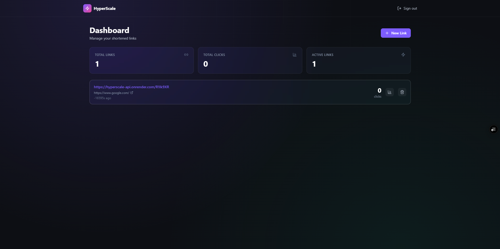
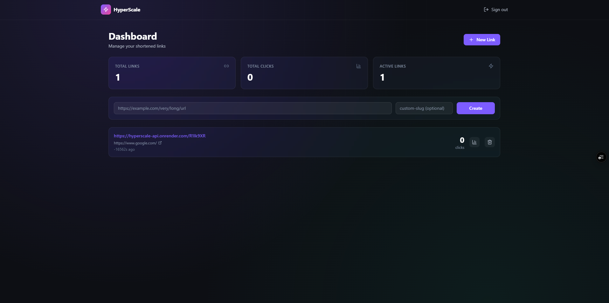

# HyperScale — Distributed URL Shortener

A production-style URL shortener with user accounts, custom short links, click
analytics, and a queue-decoupled architecture. Built to demonstrate backend
system design: async APIs, cache-aside reads, queue-decoupled writes, JWT auth,
and containerized deployment.

[](https://github.com/AnudeepAV/hyperscale-url-shortener/actions)
[](https://opensource.org/licenses/MIT)
[](https://www.python.org/downloads/release/python-3120/)
[](https://nextjs.org/)

**Live demo**
- Frontend: https://hyperscale-url-shortener.vercel.app
- API docs (Swagger): https://hyperscale-api.onrender.com/docs

> The hosted demo runs on free-tier infrastructure. The first request after a
> period of inactivity may take ~30–50s while the backend cold-starts.

---

## What this project demonstrates

A deliberate showcase of backend system design patterns, not a basic CRUD app:

- **Hot-path optimization** — redirects are served via a Redis cache-aside
  layer, falling back to PostgreSQL only on a cache miss.
- **Queue-decoupled writes** — click events are enqueued to Celery rather than
  written inline, so the redirect response never blocks on analytics work.
- **Real-time capability** — a WebSocket endpoint streams click events to
  subscribers via Redis pub/sub.
- **Security** — JWT authentication with access and refresh tokens, input
  validation, and rate limiting.
- **Observability** — structured JSON logging and a Prometheus metrics endpoint.
- **Containerized** — multi-stage Docker builds running as a non-root user;
  one-command local startup with Docker Compose.
- **CI** — GitHub Actions pipeline with PostgreSQL and Redis service containers.

---

## Architecture
┌─────────────────┐
│   Next.js UI    │  ← Vercel
│  + WebSockets   │
└────────┬────────┘
│ HTTPS / WSS
▼
┌─────────────────────────────────────────────┐
│         FastAPI Backend  (Render)            │
│  ┌──────────┐  ┌──────────┐  ┌────────────┐ │
│  │  Auth    │  │  URLs    │  │ Redirect   │ │
│  │  (JWT)   │  │ (CRUD)   │  │ (hot path) │ │
│  └──────────┘  └──────────┘  └─────┬──────┘ │
│                                    │        │
│  ┌──────────────────────────────┐  │        │
│  │   WebSocket /ws/clicks/:c    │  │        │
│  └──────────────┬───────────────┘  │        │
└─────────────────┼──────────────────┼────────┘
│                  │
│ Pub/Sub          │ Enqueue
▼                  ▼
┌────────────────┐  ┌──────────────┐
│      Redis     │  │    Celery    │
│   (Upstash)    │◄─│    Worker    │
│  Cache + Queue │  │ (writes hits)│
└────────────────┘  └──────┬───────┘
│
▼
┌───────────────┐
│  PostgreSQL   │
│  (Supabase)   │
└───────────────┘
**Design rationale**
- Redirects are read-heavy and latency-sensitive → cache-aside with Redis.
- Click writes are write-heavy and tolerate eventual consistency → async via Celery.
- Live dashboards need pushed updates → Redis pub/sub + WebSockets.
- Services are decoupled → API and workers can scale independently.

PostgreSQL is the source of truth. Redis serves hot reads and acts as the
Celery broker.

> **Note on the hosted demo:** the Celery worker is not deployed in the hosted
> free-tier environment. In the hosted demo, click events are therefore
> enqueued but not consumed, so the demo's click counter does not increment.
> The full pipeline — redirect → enqueue → worker consumes → count updates —
> has been verified running locally via Docker Compose, which starts the
> worker. This is a deployment trade-off, not a design gap: the redirect path
> is intentionally decoupled from analytics processing.

---

## Tech stack

### Backend
- **FastAPI** (Python 3.12) — async-first, auto-generated OpenAPI docs
- **SQLAlchemy 2.0** + **asyncpg** — typed ORM with native async
- **Pydantic v2** — request/response validation
- **PostgreSQL** — primary data store, indexed for hot queries
- **Redis** — cache, queue broker, and pub/sub
- **Celery** — distributed task queue
- **structlog** — JSON-formatted structured logging
- **Prometheus client** — metrics export

### Frontend
- **Next.js** (App Router) + **TypeScript**
- **Tailwind CSS** + custom design tokens
- **Recharts** — analytics visualization
- **Zustand** — lightweight state management

### Infrastructure
- **Docker** + **Docker Compose** — local dev parity with production
- **GitHub Actions** — CI with service containers
- **Render** (backend), **Vercel** (frontend), **Supabase** (PostgreSQL),
  **Upstash** (Redis) — all free tier

---

## Performance

Performance baselines have not yet been formally established. Load testing to
measure redirect latency, throughput, and cache hit ratio is planned — see
[Roadmap](#roadmap).

---

## Running locally

Requires Docker Desktop.

```bash
git clone https://github.com/AnudeepAV/hyperscale-url-shortener.git
cd hyperscale-url-shortener

cp backend/.env.example backend/.env   # then fill in values

docker-compose up --build
```

Open:
- Frontend: http://localhost:3000
- API docs: http://localhost:8000/docs
- Metrics: http://localhost:8000/metrics
- Health: http://localhost:8000/health

Running locally starts the Celery worker, so the click analytics pipeline works
end to end.

### Running without Docker

**Backend:**
```bash
cd backend
python -m venv venv
source venv/bin/activate         # Windows: venv\Scripts\activate
pip install -r requirements.txt
cp .env.example .env
uvicorn app.main:app --reload
```

**Celery worker (separate terminal):**
```bash
cd backend
source venv/bin/activate
celery -A app.workers.celery_app worker --loglevel=info
```

**Frontend (separate terminal):**
```bash
cd frontend
npm install
cp .env.local.example .env.local
npm run dev
```

---

## Project structure
hyperscale-url-shortener/
├── backend/
│   ├── app/
│   │   ├── api/              # Route handlers
│   │   │   ├── auth.py       # Register/login/refresh
│   │   │   ├── urls.py       # URL CRUD + analytics
│   │   │   ├── redirect.py   # Hot path: short → long
│   │   │   └── websocket.py  # /ws/clicks/:code
│   │   ├── core/             # Config, security, logging
│   │   ├── db/               # Session, Redis client
│   │   ├── middleware/       # Rate limiting
│   │   ├── models/           # SQLAlchemy ORM models
│   │   ├── schemas/          # Pydantic schemas
│   │   ├── services/         # Business logic (cache-aside)
│   │   ├── utils/            # Base62, UA parsing
│   │   ├── workers/          # Celery tasks
│   │   ├── tests/            # pytest
│   │   └── main.py           # FastAPI app entry
│   ├── Dockerfile            # Multi-stage, non-root
│   └── requirements.txt
├── frontend/
│   ├── src/
│   │   ├── app/              # Next.js App Router pages
│   │   │   ├── page.tsx      # Landing + shortener
│   │   │   ├── login/
│   │   │   ├── register/
│   │   │   └── dashboard/
│   │   │       └── [shortCode]/  # Analytics view
│   │   ├── components/       # Reusable UI
│   │   ├── hooks/            # useLiveClicks (WebSocket)
│   │   └── lib/              # API client, auth store
│   ├── Dockerfile
│   └── package.json
├── .github/workflows/
│   └── ci.yml                # GitHub Actions pipeline
├── docker-compose.yml
└── README.md
---

## API reference

### Auth
| Method | Endpoint | Description |
|---|---|---|
| POST | `/api/v1/auth/register` | Create account |
| POST | `/api/v1/auth/login` | Obtain JWT pair |
| POST | `/api/v1/auth/refresh` | Refresh access token |

### URLs
| Method | Endpoint | Auth | Description |
|---|---|---|---|
| POST | `/api/v1/urls` | optional | Shorten a URL |
| GET | `/api/v1/urls` | required | List the user's URLs |
| DELETE | `/api/v1/urls/:id` | required | Delete a URL |
| GET | `/api/v1/urls/:code/analytics` | required | Aggregated analytics |
| GET | `/:code` | none | Redirect (hot path) |
| WS | `/ws/clicks/:code` | none | Live click stream |

Full interactive docs at `/docs`.

---

## Testing

```bash
# Backend
cd backend
pytest -v

# Frontend type check
cd frontend
npm run type-check
```

---

## Screenshots

<!-- Add images to a /screenshots folder and reference them here -->




---

## Roadmap

- [ ] Load testing (k6 / wrk) to establish real latency and throughput baselines
- [ ] Deploy the Celery worker so hosted analytics run end to end
- [ ] Alembic migrations (schema currently created via SQL)
- [ ] Geo-IP enrichment for click analytics
- [ ] QR code generation per short link
- [ ] Custom domain support (vanity URLs)

---

## Author

**Anudeep Munagala**
- LinkedIn: [linkedin.com/in/anudeep-munagala](https://linkedin.com/in/anudeep-munagala)
- GitHub: [github.com/AnudeepAV](https://github.com/AnudeepAV)
- Email: munagalaanudeep2002@gmail.com

---

## License

MIT — see [LICENSE](LICENSE)